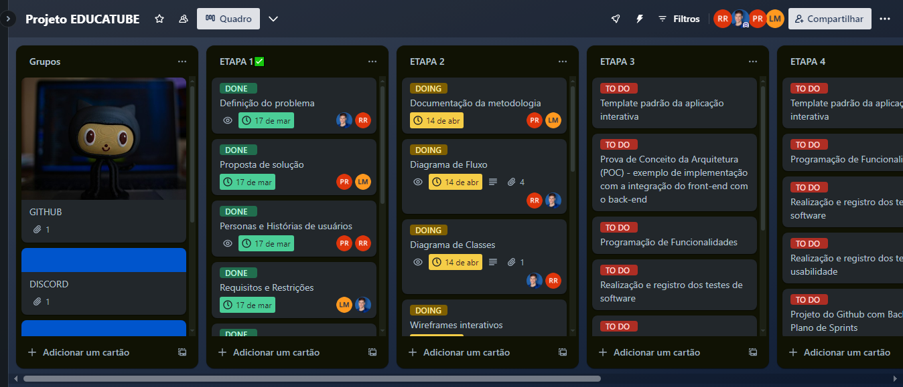
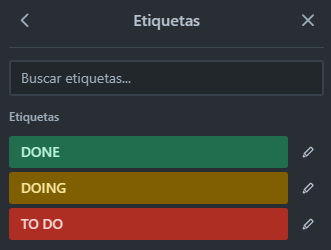

# Metodologia

Após observar que várias plataformas de estudo, por mais que tenham bons conteúdos, existiam vários estímulos para “desfocar” o usuário. A partir desta identificação, o entendemos que poderia ser criado um site onde a metodologia proposta é que, após o cadastro do usuário, os vídeos que o usuário tenha interesse possam ser organizados e assistidos em único local sem interferência de estímulos externos. Além disso, com o intuito de facilitar o foco do usuário, será disponibilizado um calendário onde ele possa criar os eventos de estudo, um “pomodorometro” para gestão do tempo de estudo e um bloco de anotações para facilitar a notação dos pontos que o usuário achar necessário registrar.

## Controle de Versão

A ferramenta de controle de versão adotada no projeto foi o
[Git](https://git-scm.com/), sendo que o [Github](https://github.com)
foi utilizado para hospedagem do repositório.

O projeto segue a seguinte convenção para o nome de branches:

- `main`: versão estável já testada do software
- `unstable`: versão já testada do software, porém instável
- `testing`: versão em testes do software
- `dev`: versão de desenvolvimento do software

Quanto à gerência de issues, o projeto adota a seguinte convenção para
etiquetas:

- `documentation`: melhorias ou acréscimos à documentação
- `bug`: uma funcionalidade encontra-se com problemas
- `enhancement`: uma funcionalidade precisa ser melhorada
- `feature`: uma nova funcionalidade precisa ser introduzida

## Gerenciamento de Projeto
A metodologia ágil escolhida para o desenvolvimento deste projeto foi o SCRUM. O Scrum foi escolhido por sua capacidade de proporcionar uma visão clara dos resultados, ritmo de execução, definição clara de papéis e responsabilidades, empowerment da equipe, compartilhamento de conhecimento e ambiente propício para críticas construtivas. 

### Divisão de Papéis

A equipe está organizada da seguinte maneira:
- Scrum Master: <b>Leticia Mateus</b>
- Product Owner: <b>Pedro Rosas</b>
- Equipe de Desenvolvimento: 
  - <b>Allan Antônio</b>
  - <b>Leticia Mateus</b> 
  - <b>Marcus Vinícius</b> 
  - <b>Pedro Rosas</b> 
  - <b>Riniel Santos</b> 

### Processo
Para a organização e distribuição das tarefas do projeto, a equipe está utilizando o Trello, estruturado com listas para cada etapa de desenvolvimento do projeto. Cada tarefa é representada por um cartão, e etiquetas são utilizadas para definir o estado atual de cada tarefa. Essa abordagem permite que a equipe acompanhe o progresso de forma eficiente e mantenha todos os membros informados sobre o status das atividades.
<figure> 
  

### Etiquetas
- To Do: Recebe essa etiqueta as tarefas que ainda não foram iniciadas. 
- Doing: Quando uma tarefa tiver sido iniciada, ela é marcada com essa etiqueta. 
- Done: Estas etiquetas são colocadas nas tarefas que passaram pelos testes e controle de qualidade e estão prontos para ser entregues ao usuário. Não há mais edições ou revisões necessárias, ele está agendado e pronto para a ação.
<figure> 
  

### Ferramentas

Para o desenvolvimento do projeto, utilizamos um conjunto de ferramentas cuidadosamente selecionados para otimizar a colaboração e o gerenciamento de tarefas. Nossa equipe empregou as seguintes:

- Repositório de Código Fonte - [GitHub](https://github.com/)
- Documentos do Projeto - [GitHub](https://github.com/)
- Projeto de Interface - [Figma](https://www.figma.com/)
- Arquitetura e diagramas - [LucidChart](https://www.lucidchart.com/pages/pt)
- Gerenciamento do Projeto - [GitHub](https://github.com/)
- Hospedagem - [GitHub Pages](https://pages.github.com/)
- Editor de código - [Visual Studio Code](https://code.visualstudio.com/)
- Ferramentas de comunicação - [Microsoft Teams](https://teams.microsoft.com/) [Discord](https://discord.com/)

Os artefatos do projeto são desenvolvidos a partir de diversas plataformas e a relação dos ambientes com seu respectivo propósito é apresentada na tabela que se segue.

| AMBIENTE                            | PLATAFORMA                         | LINK DE ACESSO                         |
|-------------------------------------|------------------------------------|----------------------------------------|
| Repositório de código fonte         | GitHub                             |aa|
| Documentos do projeto               | GitHub                             |aa|
| Projeto de Interface                | Figma                              |aa|
| Gerenciamento do Projeto            | GitHub                             |aa|
