# Projeto de Interface

## Diagrama de Fluxo

O diagrama apresentado na Figura 4 mostra o fluxo de interação do usuário pelas telas do sistema. Cada uma das telas deste fluxo é detalhada na seção de Wireframes que se segue. Para visualizar o wireframe interativo, acesse o edereço o repositório Github do projeto.

<figure> 
  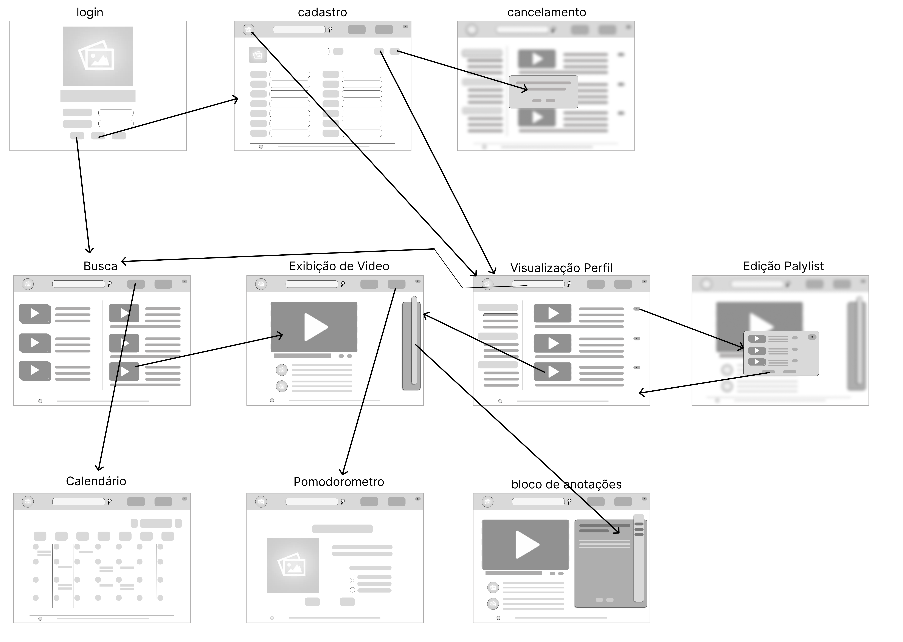Figura 4 - Wireframe dos principais componentes presentes no app e o fluxo de interação do usuário com os mesmos</figcaption>
</figure>

## Wireframes

## Modelo de Página

Conforme fluxo de telas do projeto, apresentado no item anterior, as telas do sistema são apresentadas em detalhes nos itens que se seguem. As telas do sistema apresentam estruturas comuns que são apresentadas na Figura 5. Nesta estrutura, existem 3 grandes componentes, descritos a seguir. São eles:

- Cabeçalho: Contendo os botões de navegação direta mais relevantes para a navegação do usuário.
- Corpo de conteúdo: Contendo as informações com as quais o usuário irá interagir.
- Rodapé: Contendo as  informações sobre a equipe que desenvolveu o app.

<figure> 
  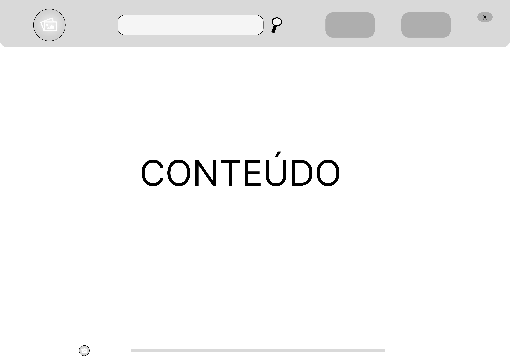Figura 5 - Wireframe modelo </figcaption>
</figure>

## Página de login
A tela Página de login tem como objetivo possibilitar ao usuário a entrada na aplicação. Com base na estrutura modelo padrão sem o Header, ela mostra a logo do site, seu nome e temos os seguintes componentes:
- Componente de **Usuário**, na qual permite ao usuário preencher a caixa de texto com seu email, para posteriormente conseguir acesso ao site;
- Componente de **Senha**, na qual permite ao usuário preencher a caixa de texto com sua senha, para juntamente com componente de **Usuário** e componente **Login**, conseguir entrar no site;
- Componente de **Login**, consiste em um botão que permite o usuário ao ser clicado entrar no site depois de preencher os componentes de **Usuário** e **Senha**;
- Componente de **Registre-se**, consiste em um botão que permite o usuário ao ser clicado ir para página de formulário de usuário voluntário para que possa efetuar seu cadastro no site;
- Componente **Esqueci minha senha**, consiste em um botão que permite o usuário ao ser clicado ir para página de recuperação de senha e recuperá-la;

<figure> 
  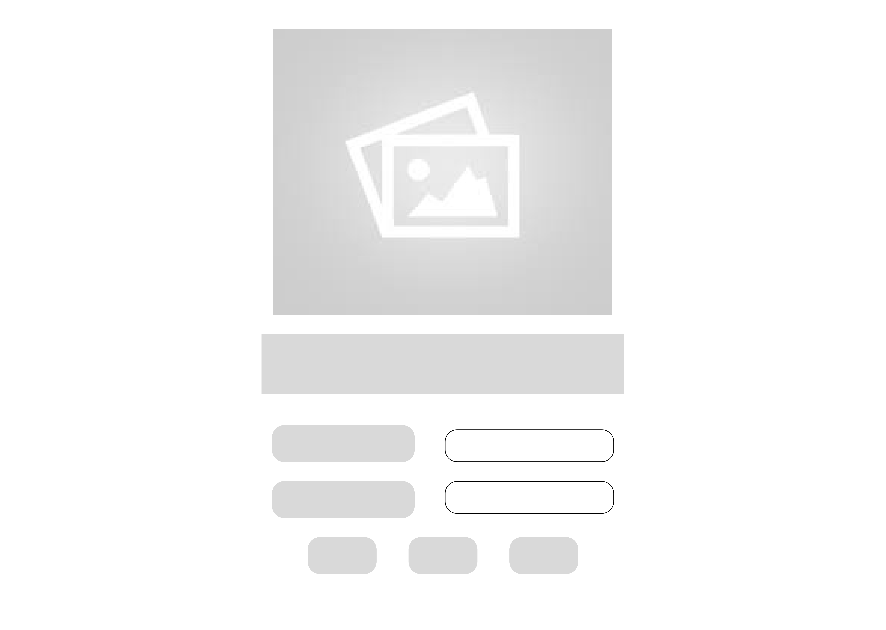Figura 6 - Página de login e registro dos usuários</figcaption>
</figure> 

## Página de formulário de cadastro
A tela Página de formulário de cadastro tem como objetivo possibilitar ao usuário voluntário preencher seus dados para que possa se cadastrar no site e efetuar seu login no mesmo, além disso permite a alteração de informações e desativamento do perfil. Com base na estrutura do modelo sem o Header, temos os seguintes componentes:
- Componente de **E-mail**, na qual permite que o usuário voluntário preencha a caixa de texto com seu e-mail para cadastro no site;
- Componente de **Senha**, na qual permite que o usuário voluntário preencha a caixa de texto com sua senha para cadastro no site;
- Componente de **Selecione uma foto para ilustrar seu perfil**, na qual permite que o usuário voluntário escolha uma foto para colocar em seu perfil;
- Componente de **Preview**, permite ao usuário voluntário ver como sua foto ficará no perfil previamente;
- Componente de **Caixa imagem**, local de armazenamento da foto escolhida para perfil;
- Componente de **Enviar**, consiste em um botão que permite o usuário voluntário ao ser clicado, enviar a imagem escolhida para colocar no componente **Caixa imagem**;
- Componente de **Concluir**, consiste em um botão que permite o usuário voluntário ao ser clicado, concluir seu cadastro no site e ir para Página de login;
- Componente de **Descartar**, consiste em um botão que permite o usuário voluntário ao ser clicado, descartar as informações do formulário;
- Componente de **Desativar Perfil**, consiste em um botão que permite o usuário voluntário ao ser clicado, desativar sua conta. Este componente só ficará visível se já houver sido realizado um login a aplicação previamente, ou seja, já possuir cadastro. 
<figure> 
  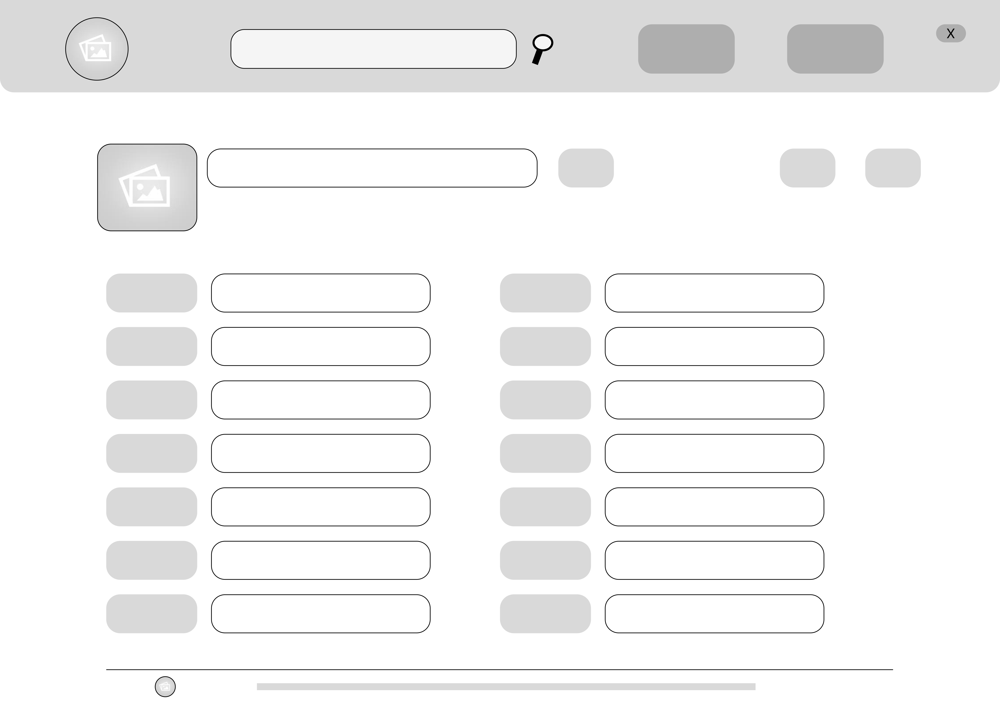Figura 7 - Página com o formulário de cadastro</figcaption>
</figure> 

## Página de busca
A tela Página de busca tem como objetivo possibilitar ao usuário fazer buscas de videos com temas de assuntos do seu interesse. Com base na estrutura modelo temos como componente, **Botão de busca**, o qual consiste em um botão ao ser clicado permite que o usuário veja a lista resultado de videos e playlists sobre o assunto pesquisado.

<figure> 
  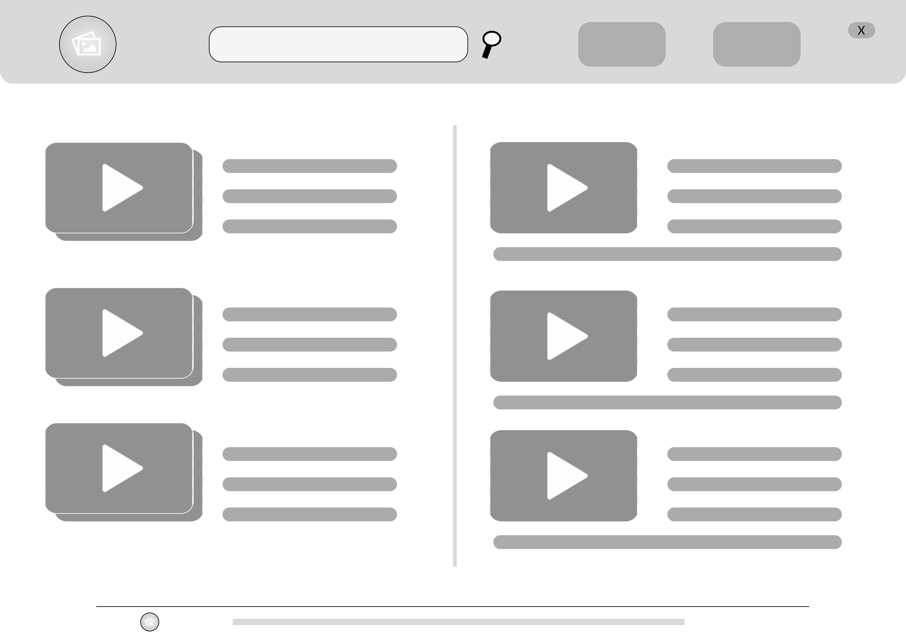 Figura 8 - Página de busca com opções resultados listados</figcaption>
</figure> 

## Página de visualização de videos
A figura a baixo ilustra o objetivo do projeto demonstrando o video em um ambiente limpo de extimulos desnecessários, desta forma ajudando o usuário a manter a concentração. 

<figure> 
  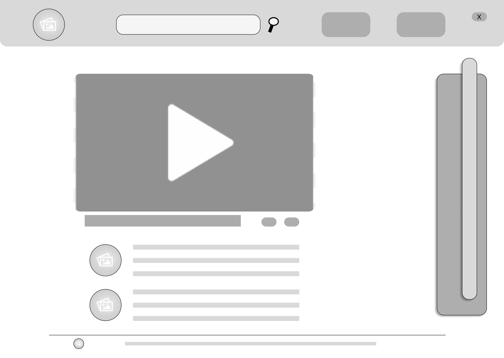 Figura 9 - Página de visualização de videos em uma página limpa de estimulos</figcaption>
</figure> 

## Página de visualização do perfil 
A tela Página de visualização do perfil do usuário, tem como objetivo mostrar ao usuário visualização do seu hitórico de navegação e lista de playlists. 

<figure> 
  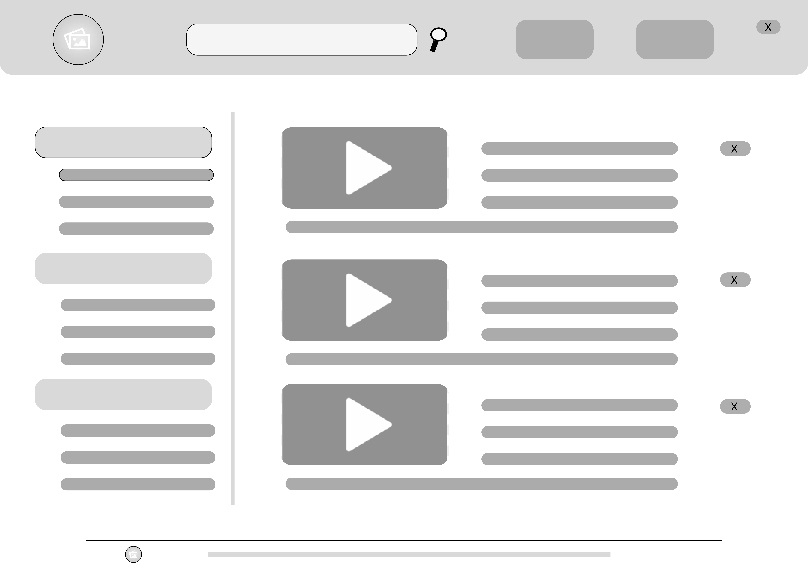 Figura 10 - Página de visualização do perfil de usuário</figcaption>
</figure> 

## Página de edição de playlist
A tela Página de playlist permite ao usuário editar suas playlists com as seguintes interações:
- Componente de **adcionar**, na qual consiste no botão que adiciona o presente video a sua playlist selecionada; 
- Componente de **Criar nova** que consiste em um botão que permite a criação de uma nova playlist.
- Componente de **excluir** que consiste em um botão que permite excluir um vídeo ou playlist já existente.

<figure> 
  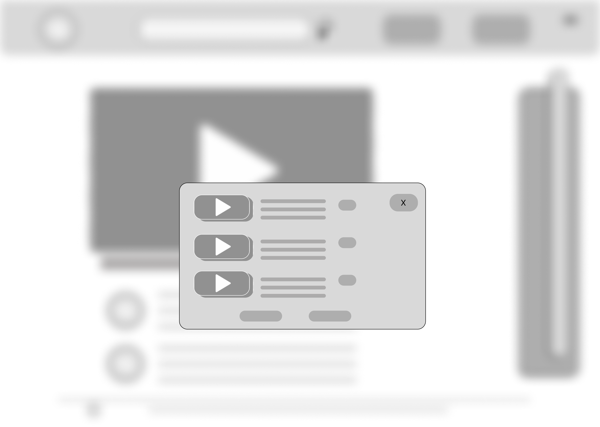 Figura 11 - Página de edição de playlist</figcaption>
</figure> 

## Página de edição do bloco de notas
A tela Página de edição do bloco de notas mostra a interação do usuário com o bloco de notas, este pode fazer uso dos seguintes componentes: 
- Componente de **lista de notas**, consiste em um botão que permite o usuário organar e acessar suas anotações anteriores pelo nome que este escolheu;
- Componente de **Definir nome**, consiste em uma área de edição de texto onde o usuário pode escrever o nome pelo qual gostaria de se referir a sua atual anotação;
- Componente de **Área de Anotação**, consiste em uma área de edição de texto em que o usuário pode fazer e editar suas anotações;
- Componente de **Botão salvar**, consiste em um botão que permite ao usuário salvar sua atual anotação;
- Componente de **Botão deletar**, consiste em um botão que permite ao usuário deletar sua atual anotação;
  
<figure> 
  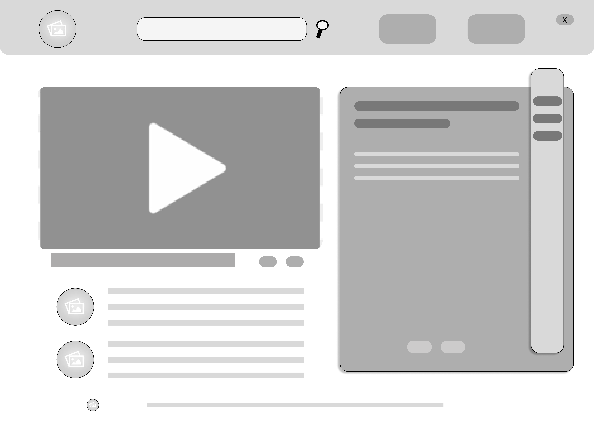 Figura 12 - Página de edição do bloco de notas</figcaption>
</figure> 

## Página de calendário
A Página de calendário permite ao usuário interagir com o calendário criando, editando ou deletando eventos no calendário, este pode fazer uso dos seguintes componentes: 
- Componente de **Criar**, o usuário pode interagir clicando na data que preferir criando um evento de sua escolha;
- Componente de **editar**, o usuário pode interagir clicando no evento que preferir para editar este mesmo evento;
- Componente de **Cancelar**, o usuário pode interagir clicando no evento que preferir cancelando este mesmo evento;

<figure> 
  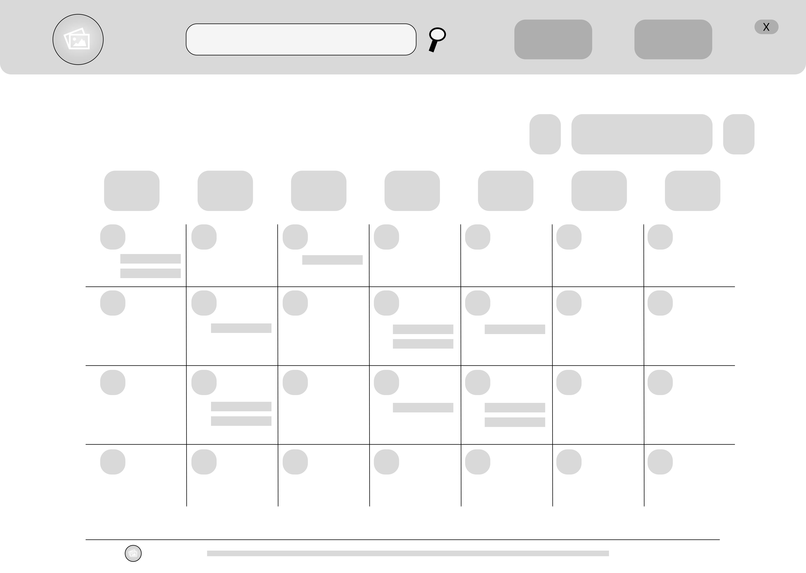 Figura 13 - Página de calendário</figcaption>
</figure> 

## Página de formulário do pomodorómetro
A tela Página de formulário de pomodorómetro permite ao usuário configurar seu pomodorómetro de acordo com suas necessidades de uso segundo as intruções descritas na página, ele poderá intergir com os seguintes componentes: 
- Componente **Duração de intervalo**, consiste em uma caixa de opção estilo radio que pede ao usuário selecionar a duração dos intervalos medidos pelo pomodorómetro;
- Componente **quantidade de intervalos**, consiste em uma caixa de opção no estilo radio que pede ao usuário definir quantos intervalos pomodoro ele quer usar;
- Componente **Travamento de tela**, consiste em um botão tipo on/off que permite ao usuário definir se a tela ficará travada durante o intervalo entre os pomodoros.

<figure> 
  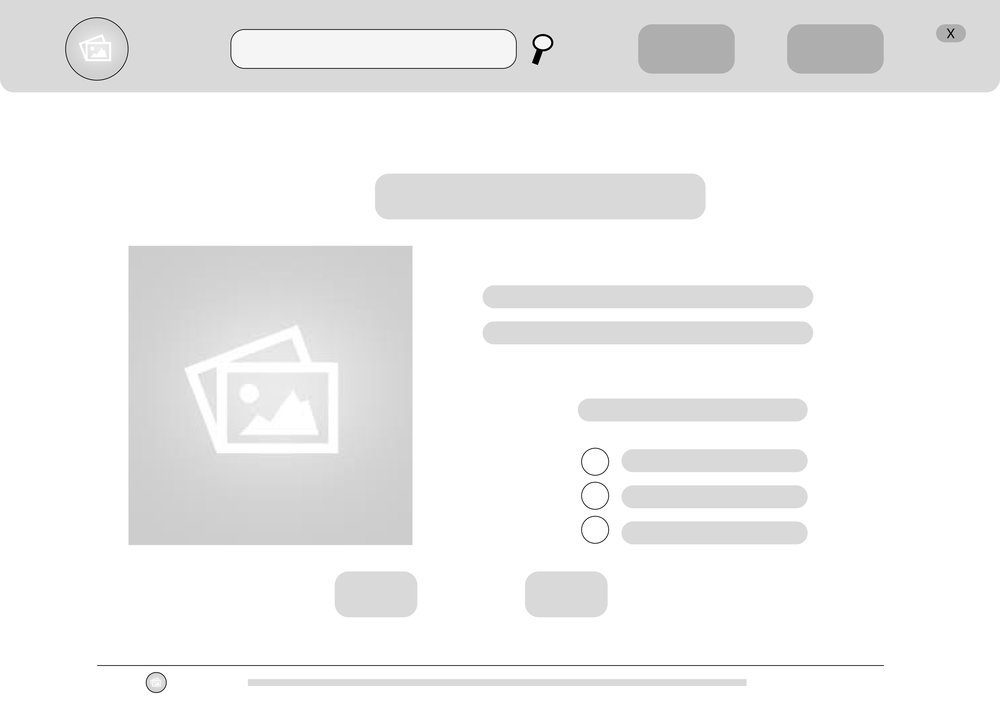 Figura 14 - Página com formulário do pomodorómetro</figcaption>
</figure> 

## Janela de cancelamento de perfil
A janela de cancelamento de perfil permitem ao usuário desativar Perfil, nela ele pode interagir com os seguintes componentes: 
- Componentede **botão sair**, consiste em um botão que sai da janela de cancelamento;
- Componente **botão cancelar**, consiste em um botão que, quando clicado pelo usuário, confirma o cancelamento de sua conta no site.

<figure> 
  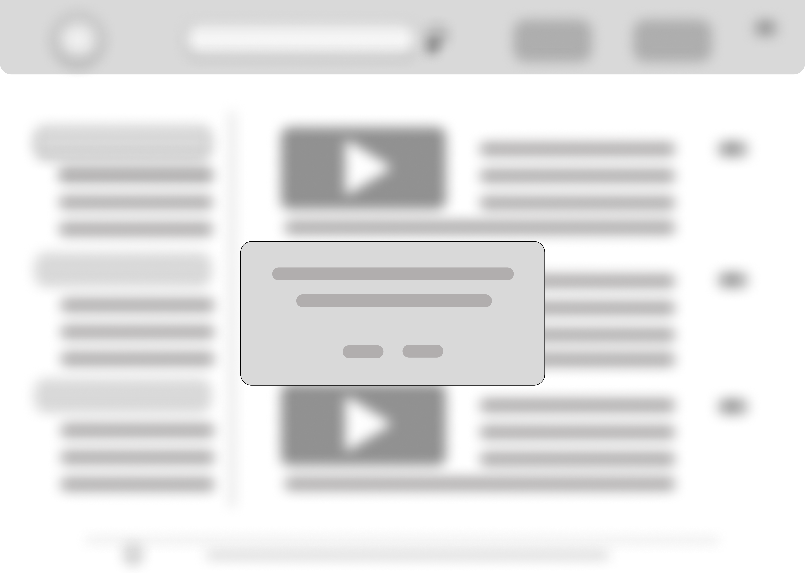 Figura 15 - Página com formulário de cancelamento de perfil</figcaption>
</figure> 
