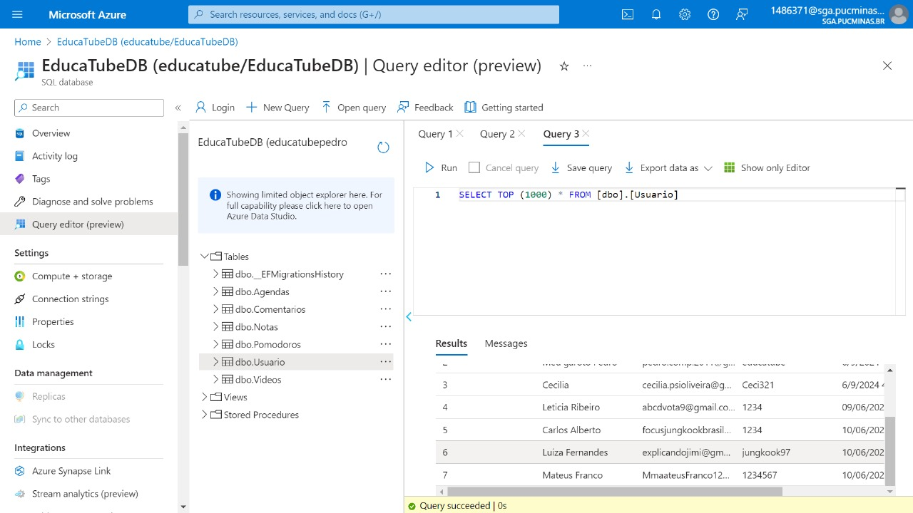

# Registro de Testes de Software

| **Caso de Teste** 	| **CT-01 – Cadastro de Usuário** 	|
|:---:	|:---:	|
|	Requisito Associado 	| RF-001 - O site permite cadastrar o usuário com sucesso. |
|Registro de evidência | https://youtu.be/CJ9SLbPenlM |
|   |   |
| **Caso de Teste** 	| **CT-02 – Login do Usuário** 	|
|	Requisito Associado 	| RF-002 - O site deve oferecer ao usuário a página de Login para ser efetuado o acesso ao site. |
|Registro de evidência | https://youtu.be/4py17zhhGP0 |
|   |   |
| **Caso de Teste** 	| **CT-003 - Sistema de Anotações** 	|
|	Requisito Associado 	| RF-005 - O site deve oferecer ao usuário um sistema onde ele possa fazer anotações e salvá-las. (CRUD) |
|Registro de evidência | https://youtu.be/KCMyh3rC6nQ |
|   |   |
| **Caso de Teste** 	| **CT-004 - Sistema de busca** 	|
|	Requisito Associado 	| RF-007 - O site deve oferecer ao usuário ferramentas de busca local de vídeos ou playlists. |
|Registro de evidência | |
|   |   |
| **Caso de Teste** 	| **CT-005 - Recuperação de senha** 	|
|	Requisito Associado 	| RNF-04 - O sistema de identificação do usuário deve permitir recuperar senha em caso de esquecimento, mudar senha quando necessário e identificar quando o usuário está logado. |
|Registro de evidência | |

# print do servidor com as tabelas

